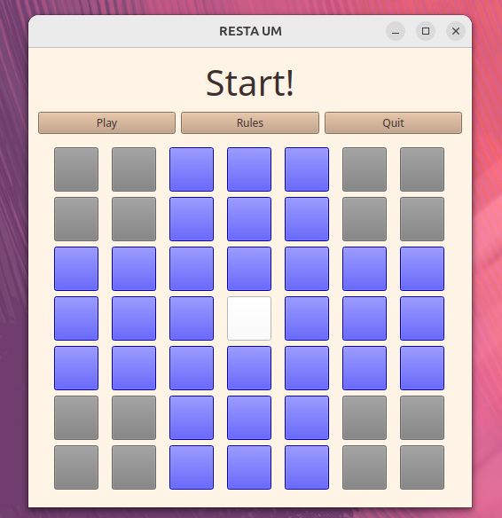

# RestaUm

RestaUm(Marble Solitaire) game project.

## Images
(subjected to change)

<div style="display: flex; overflow-x: auto; gap: 10px;">
    
    
    
</div>

## Made with:
- Python
- PyQt5

## Running source
1. clone the repository:
```sh
    git clone https://github.com/BiancaNCoelho/RestaUm.git
    cd RestaUm
```
2. install dependencies:
```sh
    pip install -r requirements.txt
```
3. building:
```sh
    python main.py
```

## Developed by: 

[Raíssa Nunes Coelho](https://github.com/raissa-coelho)
 
[Bianca Nunes Coelho](https://github.com/BiancaNCoelho) 
